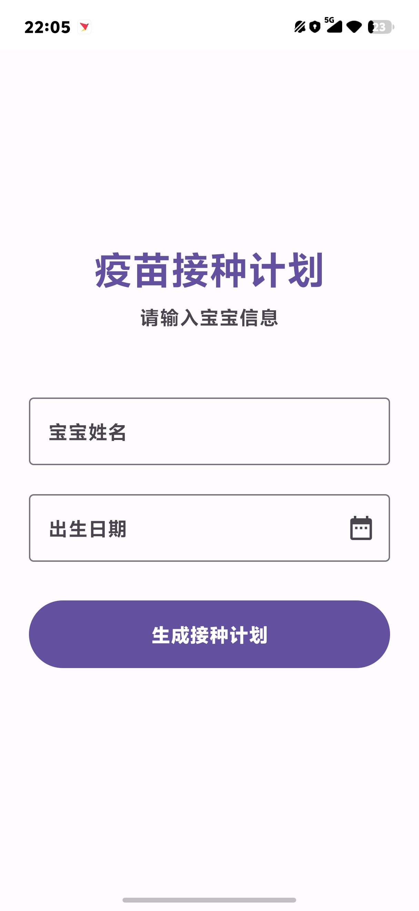
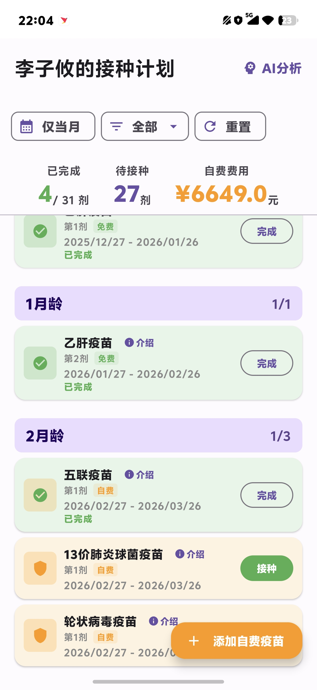
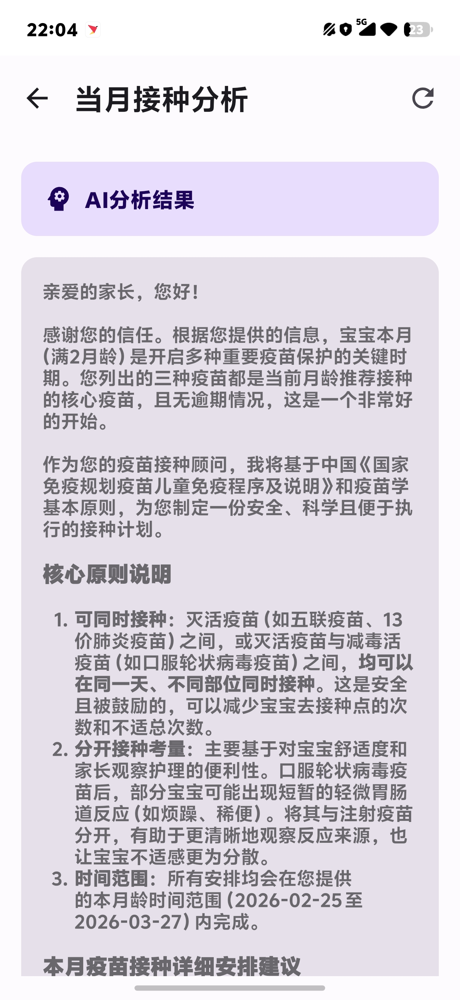
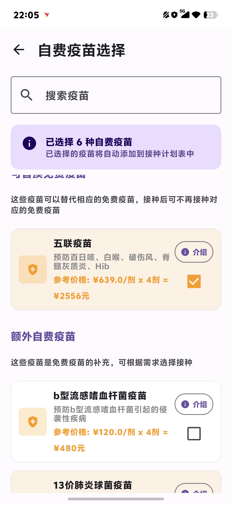
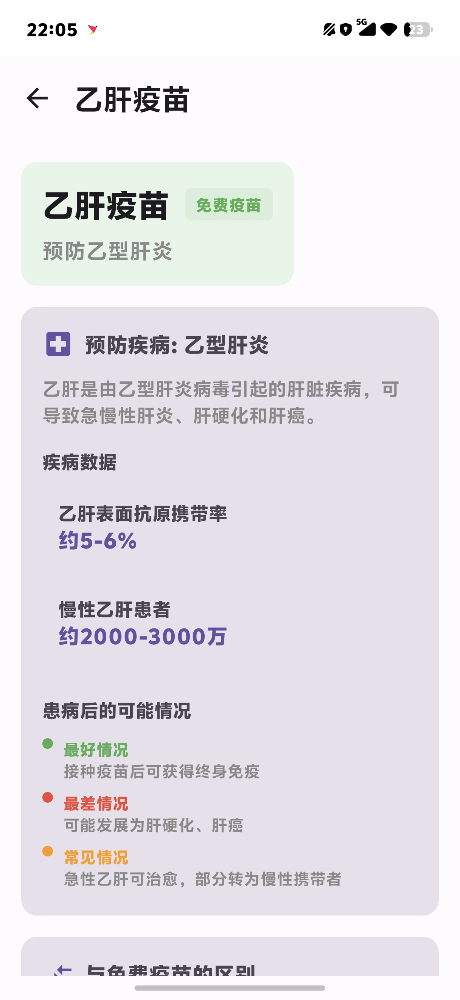
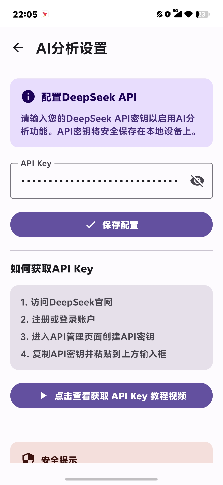

# 婴儿疫苗计划 (Baby Vaccine Planner)

一个专为家长设计的Android应用，帮助管理婴儿疫苗接种计划，并提供AI智能分析功能。

[](https://kotlinlang.org)
[](https://developer.android.com)
[](https://developer.android.com/jetpack/compose)
[](https://developer.android.com/studio/releases/gradle-plugin)
[](LICENSE)

## 📱 功能特性

### 🎯 核心功能
- **婴儿信息管理**：记录宝宝姓名和出生日期
- **疫苗接种计划**：自动生成0-6岁标准疫苗接种时间表
- **疫苗分类**：区分免费疫苗（一类）和付费疫苗（二类）
- **进度跟踪**：标记疫苗接种完成状态，记录接种日期
- **自定义计划**：添加付费疫苗到个人接种计划

### 🤖 AI智能分析
- **整体计划分析**：AI评估疫苗接种计划的合理性和完整性
- **当月接种提醒**：分析当月需要接种的疫苗及注意事项
- **疫苗详情查询**：获取疫苗详细信息、疾病预防效果和注意事项
- **实时流式响应**：支持AI回答的实时流式显示

### 🎨 用户体验
- **现代化界面**：采用Material Design 3设计规范
- **流畅动画**：页面切换和状态变化的平滑动画效果
- **离线存储**：本地数据持久化，无需网络即可使用
- **响应式设计**：适配不同屏幕尺寸和设备

## 🛠️ 技术栈

- **语言**：Kotlin 100%
- **UI框架**：Jetpack Compose
- **架构**：MVVM (Model-View-ViewModel)
- **异步处理**：Kotlin Coroutines & Flow
- **网络请求**：OkHttp + SSE (Server-Sent Events)
- **数据持久化**：JSON文件存储
- **AI集成**：DeepSeek API
- **Markdown渲染**：Markwon库
- **依赖注入**：手动依赖管理

## 📸 应用截图

| 婴儿信息录入 | 疫苗接种计划 | AI分析结果 |
|--------------|--------------|------------|
|  |  |  |

| 付费疫苗列表 | 疫苗详情 | AI设置 |
|--------------|----------|--------|
|  |  |  |

> 注：截图路径为 `screenshots/`，格式为 JPG

## 🚀 快速开始

### 前提条件
- Android Studio Hedgehog (2023.1.1) 或更高版本
- JDK 17 或更高版本
- Android SDK 34 (Android 14)
- 有效的DeepSeek API密钥（用于AI功能）

### 构建步骤

1. **克隆仓库**
```bash
git clone https://github.com/yourusername/baby-vaccine-planner.git
cd baby-vaccine-planner/VaccinePlanner
```

2. **配置API密钥（可选）**
   - 应用支持两种方式配置DeepSeek API密钥：
     1. **应用内配置**：启动应用后，进入"AI设置"页面直接输入API密钥（推荐）
      2. **配置文件方式**：复制项目根目录的 `api_config.xml.example` 到 `app/src/main/res/values/api_config.xml`，添加你的API密钥
   - AI功能需要有效的DeepSeek API密钥，可在[DeepSeek官网](https://platform.deepseek.com/)获取

3. **构建和运行**
```bash
# 使用Gradle Wrapper构建
./gradlew assembleDebug

# 安装到设备
adb install app/build/outputs/apk/debug/app-debug.apk
```

4. **在Android Studio中运行**
   - 打开 `VaccinePlanner` 目录
   - 连接Android设备或启动模拟器
   - 点击运行按钮 ▶️

## 🤖 AI功能配置

应用集成了DeepSeek AI服务，提供智能疫苗接种分析。配置方法：

1. **获取API密钥**
   - 访问 [DeepSeek官网](https://platform.deepseek.com/) 注册账号
   - 在控制台获取API密钥

2. **应用内配置**
   - 启动应用后，进入"AI设置"页面
   - 输入你的DeepSeek API密钥
   - 保存配置即可使用AI功能

3. **可用AI功能**
   - **整体计划分析**：评估整个疫苗接种计划
   - **当月接种分析**：分析本月需要接种的疫苗
   - **疫苗信息查询**：获取特定疫苗的详细信息

## 📁 项目结构

 ```
VaccinePlanner/
├── app/
│   ├── src/main/java/com/vaccineplanner/
│   │   ├── MainActivity.kt                    # 主活动
│   │   ├── data/
│   │   │   ├── model/                         # 数据模型
│   │   │   ├── repository/                    # 数据仓库
│   │   │   └── service/                       # 网络服务
│   │   ├── ui/
│   │   │   ├── screens/                       # 界面屏幕
│   │   │   ├── components/                    # 可复用组件
│   │   │   └── theme/                         # 主题和样式
│   │   └── viewmodel/                         # ViewModel层
│   └── src/main/res/
│       ├── values/                            # 字符串、颜色、主题等资源
│       │   ├── colors.xml
│       │   ├── strings.xml
│       │   └── themes.xml
│       ├── mipmap-*/                          # 应用图标
│       └── drawable/                          # 矢量图形资源
├── build.gradle.kts                           # 模块构建配置
├── settings.gradle                            # 项目设置
└── api_config.xml.example                     # API配置示例文件
```

## 🔧 开发指南

### 添加新疫苗
疫苗数据定义在 `VaccineRepository.kt` 中：
```kotlin
Vaccine(
    id = "new_vaccine_id",
    name = "Vaccine Name",
    chineseName = "疫苗中文名",
    description = "疫苗描述",
    diseaseInfo = DiseaseInfo(...),
    price = 0.0,
    isFree = true, // 或 false 表示付费疫苗
    doses = 1,
    intervalDays = listOf(0, 30, 180), // 各剂次间隔天数
    ageRange = "接种年龄范围"
)
```

### 自定义AI提示词
AI提示词模板在 `DeepSeekService.kt` 中修改：
```kotlin
val prompt = """
    你是一位专业的儿科疫苗接种顾问...
    宝宝出生日期：$birthDate
    疫苗接种计划：$schedule
"""
```

### 主题定制
应用主题在 `Theme.kt` 中定义，支持浅色/深色模式：
```kotlin
VaccinePlannerTheme(
    darkTheme = isSystemInDarkTheme(),
    content = { ... }
)
```

## 📊 数据模型

应用使用以下核心数据模型：

- **Baby**：婴儿基本信息（姓名、出生日期）
- **Vaccine**：疫苗信息（名称、描述、价格、剂次等）
- **VaccinationRecord**：接种记录（计划日期、完成状态）
- **DiseaseInfo**：疾病信息（发病率、预后等）

数据持久化使用JSON文件存储，位置：`应用数据目录/vaccine_data.json`

## 🤝 贡献指南

欢迎贡献代码！请遵循以下步骤：

1. Fork 本仓库
2. 创建功能分支 (`git checkout -b feature/AmazingFeature`)
3. 提交更改 (`git commit -m 'Add some AmazingFeature'`)
4. 推送到分支 (`git push origin feature/AmazingFeature`)
5. 开启 Pull Request

### 代码规范
- 使用 Kotlin 官方代码风格
- 遵循 Jetpack Compose 最佳实践
- 添加必要的注释和文档
- 确保所有功能都有相应的测试

## 💖 捐赠支持

如果你觉得这个软件不错的话，谢谢你请我喝可乐~


您的支持是我持续改进应用的动力！所有捐赠将用于：
- 服务器和维护成本
- 持续功能开发和更新
- 用户体验优化

## 📝 许可证

本项目采用 MIT 许可证 - 查看 [LICENSE](LICENSE) 文件了解详情

## 🙏 致谢

- [Jetpack Compose](https://developer.android.com/jetpack/compose) - 声明式UI框架
- [DeepSeek](https://www.deepseek.com/) - AI大语言模型服务
- [OkHttp](https://square.github.io/okhttp/) - HTTP客户端
- [Markwon](https://github.com/noties/Markwon) - Markdown渲染库

## 📞 联系与支持

- 问题反馈：请使用 [GitHub Issues](https://github.com/yourusername/baby-vaccine-planner/issues)
- 功能建议：欢迎提交 Pull Request 或 Issue
- 安全漏洞：请通过 Issue 报告，并标记为 security

---

**让疫苗接种更简单，让宝宝成长更健康！** 🍼💉

> 注意：本应用仅供参考，实际疫苗接种请咨询专业医生。